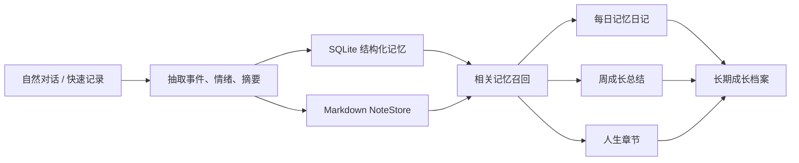

# 槿年 - AI 智能日记系统

> 对话即记录，记录即成长档案。
> 槿年不是又一个让人坚持打卡的日记本，而是一个把日常碎片沉淀为长期自我理解的 AI 桌面伙伴。

## 项目简介

槿年是一款基于 **Tauri 2 + Rust + React 19** 的本地优先型 AI 智能日记系统。

它解决的不是“怎么写一篇更漂亮的日记”，而是一个更根本的问题：大多数人并不是没有经历、没有想法、没有变化，而是没有低成本、可持续的方式把这些东西留下来、串起来、看见它们。

本项目将日记输入从“主动写作”降到“自然对话”，再通过 AI 把零散聊天、快速记录、事件记忆和定性观察沉淀为：

- 每日可回看的日记
- 可检索的事件记忆
- 周期性的成长总结
- 跨时间段的人生章节
- 长期积累的个人成长档案

一句话概括：

```text
碎片对话 -> AI 抽取与记忆 -> 日记/周总结/人生章节 -> 长期成长档案
```

## 为什么它值得做

传统日记产品通常有两个问题：

1. 输入成本高：用户需要主动组织语言、坚持记录、每天抽时间写。
2. 输出价值低：记录被保存之后往往只停留在“存档”，很少真正帮助用户看见变化。

槿年的核心思路是反过来设计：

- 用聊天降低输入成本，让记录发生在自然表达里。
- 用 AI 提高输出价值，让记录被整理、连接、总结和再利用。
- 用本地优先保护个人内容，让敏感的成长数据尽可能留在用户自己的设备上。

它更像一个长期陪伴型的个人成长系统，而不是一次性的 AI 文案生成器。

## 核心能力

### 1. 对话即记录

用户可以像和朋友聊天一样记录当天发生的事、情绪、决定和想法。系统会保存每日对话历史，并为后续日记生成和记忆检索提供材料。

### 2. 事件记忆抽取

AI 会从对话中抽取具有长期价值的事件记忆，包括事件内容、情绪、重要性、类型和时间信息。后续对话和日记生成可以自动召回相关记忆，避免每天的记录彼此孤立。

### 3. 日记生成

系统可以基于指定日期的对话、快速记录、事件记忆和相关历史，生成自然中文日记。提示词强调扎根已有材料，避免编造不存在的经历。

### 4. 周成长总结

按 ISO 周生成周总结，聚合本周日记、事件、对话摘要、观察和笔记。适合做阶段回顾，看见一周内的重复主题、压力来源、行动变化和成长线索。

### 5. 人生章节

用户可以选择任意日期范围，让系统生成一段“人生章节”。它不是简单总结，而是把一段时期里的关键事件、主题变化和内在转折组织成可编辑、可保存的长期档案。

### 6. 本地 Markdown 笔记系统

日记、周总结、人生章节都可以沉淀为 Markdown 笔记。用户既能通过应用界面查看和编辑，也能在文件系统中保留可迁移、可备份、可长期保存的文本资产。

## 产品闭环



## 技术架构

项目采用 **单 LLM + 五层沉淀系统**：

```text
1. 对话层
   用户以自然语言输入日常经历、想法和情绪。

2. 抽取层
   AI 从对话中抽取事件、情绪、摘要和可沉淀信息。

3. 记忆层
   使用 SQLite 与本地文件系统保存结构化记忆和 Markdown 笔记。

4. Reflection 层
   将分散记录整理为观察、主题、项目和成长线索。

5. 沉淀生成器
   生成日记、周总结、人生章节等长期档案。
```

### 技术栈

| 模块 | 技术 |
| --- | --- |
| 桌面应用 | Tauri 2 |
| 本地后端 | Rust |
| 前端界面 | React 19 + TypeScript |
| 构建工具 | Vite |
| 本地数据库 | SQLite / rusqlite |
| 本地笔记 | Markdown NoteStore |
| AI 调用 | 单 LLM 架构，支持流式响应 |
| 测试 | Cargo test + Vitest |
| 需求管理 | OpenSpec |

## 当前完成度

| 能力 | 状态 |
| --- | --- |
| Tauri 桌面应用框架 | 已完成 |
| 对话与每日历史 | 已完成 |
| 事件记忆抽取与保存 | 已完成 |
| 相关记忆召回 | 已完成 |
| 日记生成与重新生成 | 已完成 |
| 周总结生成、查看、编辑保存 | 已完成 |
| 人生章节生成、查看、编辑保存 | 已完成 |
| Markdown 笔记管理 | 已完成 |
| 本地安装包构建 | 已完成 |
| 自动化测试与构建验证 | 已完成 |
| 多端同步 | 后续规划 |
| 编辑历史与版本回退 | 后续规划 |

## 项目结构

```text
.
├── README.md
├── THIRD_PARTY_NOTICES.md
├── .gitignore
├── .gitattributes
└── frontend/                    # Tauri 2 桌面应用工程
    ├── package.json
    ├── vite.config.ts
    ├── tsconfig.json
    ├── index.html
    ├── tests/                   # 前端测试
    ├── src/                     # React 19 + TypeScript 前端
    │   ├── App.tsx
    │   ├── main.tsx
    │   ├── components/          # UI 组件
    │   │   └── panels/          # ChatPanel, GrowthPanel, MemoryPanel
    │   ├── features/            # 功能模块
    │   │   ├── api/             # Tauri 命令封装与测试
    │   │   ├── notes/           # 笔记管理
    │   │   ├── settings/        # 设置
    │   │   ├── windows/         # 多窗口管理
    │   │   ├── importExport/    # 导入导出
    │   │   └── markdown/        # Markdown 渲染
    │   ├── locales/             # 国际化 (i18next)
    │   └── assets/              # 静态资源
    └── src-tauri/               # Rust 本地后端
        ├── Cargo.toml
        ├── tauri.conf.json
        ├── capabilities/        # Tauri 权限配置
        ├── icons/               # 应用图标
        └── src/
            ├── main.rs
            ├── lib.rs
            ├── desktop.rs
            ├── locales.rs
            └── services/        # 核心服务模块
                ├── chat.rs          # 对话管理
                ├── diary.rs         # 日记生成
                ├── diary_memory.rs  # 日记相关记忆检索
                ├── extractor.rs     # 事件/情绪抽取
                ├── memory.rs        # 记忆管理
                ├── llm.rs           # LLM 调用
                ├── database.rs      # SQLite 数据库
                ├── notes.rs         # Markdown NoteStore
                ├── life_chapter.rs  # 人生章节
                ├── weekly_summary.rs# 周总结
                ├── config.rs        # 配置管理
                ├── scheduler.rs     # 定时任务
                └── types.rs         # 类型定义
```

## 快速运行

### 环境要求

- Node.js
- Rust toolchain
- Windows 桌面环境
- 可用的 LLM API 配置

### 启动开发模式

```powershell
cd frontend
npm install
npm run tauri dev
```

如果 PowerShell 禁止执行 `npm.ps1`，可以使用：

```powershell
npm.cmd run tauri dev
```

### 构建前端

```powershell
cd frontend
npm.cmd run build
```

### 构建桌面安装包

```powershell
cd frontend
npm.cmd run tauri build
```

构建产物位于：

```text
frontend/src-tauri/target/release/bundle/nsis/
```

## 验证命令

```powershell
cd frontend
npm.cmd test
npm.cmd run lint
npm.cmd run build

cd src-tauri
cargo test
```

当前项目已通过：

- 前端单元测试：68 passed
- Rust 测试：146 passed
- 前端 lint
- 前端生产构建
- Tauri release 构建

## 参赛亮点

### 1. 不是“AI 写日记”，而是“AI 帮你建立成长档案”

项目的关键价值不在于生成一篇日记，而在于把对话、事件、观察、总结和章节串成一个长期系统。这让产品从“内容生成工具”升级为“个人成长基础设施”。

### 2. 低输入成本，高输出价值

用户只需要自然表达，系统负责抽取、整理、召回和沉淀。它抓住了日记产品长期留存的核心矛盾：用户不想每天认真写，但又希望未来能看见过去。

### 3. 本地优先，更适合私人记录

日记、情绪和成长记录高度敏感。本项目采用本地桌面应用形态，核心数据保存在本地 SQLite 与 Markdown 文件中，兼顾 AI 能力和用户掌控感。

### 4. 有真实工程闭环

项目不是静态原型：它包含桌面端、Rust 后端、React 前端、NoteStore、SQLite、测试、构建、安装包和提交材料，具备完整的软件作品形态。

### 5. 可继续扩展

当前架构可以自然扩展到版本历史、时间线可视化、人格画像、长期趋势分析、多端同步、端侧模型和加密备份等方向。

## 隐私与安全说明

槿年面向个人日记与成长记录场景。此类数据天然敏感，因此项目默认强调：

- 本地优先保存数据
- 用户可以直接访问 Markdown 笔记
- AI 输出需要用户确认和编辑
- 不建议输入高度敏感、不可泄露的信息
- 若使用云端 LLM API，相关内容可能会发送到模型服务商

## 后续规划

- 编辑历史与撤销回退
- 更完整的 Reflection 自动观察生成
- 日记、周总结、人生章节的时间线可视化
- 来源统计 metadata 持久化
- 本地加密备份
- 多设备同步
- 更丰富的演示数据与一键体验模式

## 一句话总结

槿年想做的是一件朴素但长期有价值的事：
让人不用费力坚持写日记，也能在未来回头看见自己如何经历、如何变化、如何成长。
